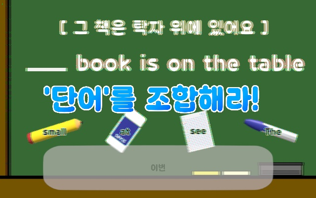

# 🌟 늘봄-영어 주문을 찾아서 (English Magic Adventure)

**플랫폼:** Leia LUME PAD 2
**대상:** 초등학교 1학년
**엔진:** Unity 2022.3+ (C# 기반)
**콘텐츠 구성:** 인트로 + 2개의 미션 + 마무리 피드백
**학습 목표:** 영어 단어 인식, 문장 구성 능력 향상

---

## 📚 목차

1. [기획 개요](#기획-개요)
2. [전체 아키텍처](#전체-아키텍처)
3. [주요 기능 및 스크립트 설명](#주요-기능-및-스크립트-설명)

   * [인트로 씬](#인트로-씬)
   * [미션 1: 단어 찾기](#미션-1-단어-찾기)
   * [미션 2: 문장 조합](#미션-2-문장-조합)
   * [공통 시스템](#공통-시스템)
4. [학습 흐름 시퀀스](#학습-흐름-시퀀스)
5. [기기/기술 요건](#기기기술-요건)

---

## 🎯 기획 개요

* **스토리:** 마법사 ‘에이미’와 함께 떠나는 영어 모험
* **주요 학습 콘텐츠:**

  * 영어 단어 인식 (apple, cat 등)
  * 문장 구성 훈련 (예: I see an apple.)
* **3D 몰입형 구성:** 입체 시각, 효과음, 피드백
* **진행 단계:** 인트로 → 미션1(단어 찾기) → 미션2(문장 조합) → 마무리

📄 참고: [콘텐츠 개요 및 목표](:contentReference[oaicite:0]{index=0}), [기능 요약](:contentReference[oaicite:1]{index=1})

---

## 🏗 전체 아키텍처

---

## 🧩 주요 기능 및 스크립트 설명

### 🔹 인트로 씬

**파일:** `Introduction_UIManager.cs`
**기능:**

* 버튼 클릭 시 캐릭터 ‘에이미’ 인사 → 카메라 이동 + Bloom → Mission1 로딩
* 터치 유도 텍스트 점멸, 텍스트 웨이브 애니메이션 적용
* `NarrationManager`와 함께 시작 음성 동기화 출력

---

### 🔹 미션 1: 단어 찾기

#### 구성

* 여러 단어가 3D 공간에 `FloatkoreaAlphabet`로 부유
* 사용자는 지정된 단어를 터치 (`TouchObjectDetector`)하여 정답 여부 판별

#### 핵심 컴포넌트

| 클래스                    | 역할                   |
| ---------------------- | -------------------- |
| `Mission1_GameManager` | 게임 흐름 제어, 정답 처리      |
| `Mission1_DataManager` | 퀴즈 단어 선택/랜덤 인덱스 생성   |
| `Mission1_UIManager`   | UI 제어 및 나레이션 출력      |
| `TouchObjectDetector`  | 오브젝트 클릭 이벤트 및 정답 판정  |
| `TouchSelf`            | 정답/오답 이벤트 처리         |
| `NarrationManager`     | 텍스트 + 음성 나레이션 동기화 출력 |

---

### 🔹 미션 2: 문장 조합

#### 구성

* 단어 조각을 드래그 앤 드롭하여 문장 완성
* 단어는 `alphabet` 태그를 이용해 선택 가능
* 빈칸은 `TextMeshProUGUI` + `SetActive(false)` 방식으로 처리

#### 핵심 컴포넌트

| 클래스                    | 역할                          |
| ---------------------- | --------------------------- |
| `Mission2_GameManager` | 전체 흐름 (시작 → 문제 5개 반복 → 클리어) |
| `Mission2_DataManager` | 문제 세팅 및 정답 저장               |
| `Mission2_UIManager`   | UI, 나레이션, 정답/오답 피드백         |
| `TouchObjectDetector`  | 오브젝트 드래그 및 드롭 판정            |
| `TouchSelf`            | 정답 판정 및 피드백 호출              |

---

### 🔸 공통 시스템

* **`NarrationManager`**
  텍스트 출력 + 음성 재생 동기화 시스템
  `DOTween.DOText`로 애니메이션 구현
  `ShowNarration(string, string)` 방식으로 클립명과 텍스트 연동

* **`CoroutineRunner`**
  코루틴을 키로 제어, 타임아웃 포함
  `RunAndWait(key, coroutine)`으로 외부 대기 로직 구현

* **`SoundManager`**
  효과음, BGM, 나레이션 재생
  `PlayNarration`, `PlaySFX`, `SaveVolumeSettings` 등 지원

* **`SettingManager`**
  볼륨 조절, 3D 모드 토글, 설정 팝업 등 기능 포함

---

## 🧭 학습 흐름 시퀀스

1. **인트로**

   * 마법사 등장 + 인사
   * Bloom 이펙트 + 카메라 전환
   * Mission1 로딩

2. **미션 1: 단어 찾기**

   * 반짝이는 단어들 → 정답 터치
   * 정답 시 축하, 오답 시 격려 멘트
   * 총 5문제 진행 후 자동 전환

3. **미션 2: 문장 조합**

   * 빈칸이 있는 문장에 단어 조각 드래그
   * 단어 순서 맞추기
   * 5문제 완료 후 클리어 애니메이션

4. **마무리**

   * 배운 단어 복습 나레이션
   * 에이미 캐릭터의 작별 인사
   * 메인 화면 자동 복귀

---

## 💻 기기/기술 요건

| 항목     | 내용                                  |
| ------ | ----------------------------------- |
| 플랫폼    | Leia LUME PAD 2 (3D 지원)             |
| 운영체제   | Android 기반                          |
| 개발환경   | Unity 2022.3 이상                     |
| 필수 패키지 | DOTween, TextMeshPro, LeiaUnity SDK |
| 입력방식   | 터치 및 드래그 제스처                        |
| 3D 출력  | LeiaDisplay를 통한 Set3DMode 처리        |

---

## 📌 부록

* **단어/문장 오디오 클립 관리:** `StringKeys.cs`를 통해 미션별 오디오 클립 키 일괄 정의
* **한국어 조사의 자연스러운 연결:** `StringUtil.KoreanParticle()`로 ‘을/를’, ‘이/가’ 자동 처리

# 🌟 늘봄-영어 주문을 찾아서 (English Magic Adventure)

**플랫폼:** Leia LUME PAD 2
**대상:** 초등학교 1학년
**엔진:** Unity 2022.3+ (C# 기반)
**콘텐츠 구성:** 인트로 + 2개의 미션 + 마무리 피드백
**학습 목표:** 영어 단어 인식, 문장 구성 능력 향상

---

## 📚 목차

1. [기획 개요](#기획-개요)
2. [전체 아키텍처](#전체-아키텍처)
3. [주요 기능 및 스크립트 설명](#주요-기능-및-스크립트-설명)

   * [인트로 씬](#인트로-씬)
   * [미션 1: 단어 찾기](#미션-1-단어-찾기)
   * [미션 2: 문장 조합](#미션-2-문장-조합)
   * [공통 시스템](#공통-시스템)
4. [학습 흐름 시퀀스](#학습-흐름-시퀀스)
5. [기기/기술 요건](#기기기술-요건)

---

## 🎯 기획 개요

* **스토리:** 마법사 ‘에이미’와 함께 떠나는 영어 모험
* **주요 학습 콘텐츠:**

  * 영어 단어 인식 (apple, cat 등)
  * 문장 구성 훈련 (예: I see an apple.)
* **3D 몰입형 구성:** 입체 시각, 효과음, 피드백
* **진행 단계:** 인트로 → 미션1(단어 찾기) → 미션2(문장 조합) → 마무리

📄 참고: [콘텐츠 개요 및 목표](:contentReference[oaicite:0]{index=0}), [기능 요약](:contentReference[oaicite:1]{index=1})

---

## 🏗 전체 아키텍처

---

## 🧩 주요 기능 및 스크립트 설명

### 🔹 인트로 씬

**파일:** `Introduction_UIManager.cs`
**기능:**

* 버튼 클릭 시 캐릭터 ‘에이미’ 인사 → 카메라 이동 + Bloom → Mission1 로딩
* 터치 유도 텍스트 점멸, 텍스트 웨이브 애니메이션 적용
* `NarrationManager`와 함께 시작 음성 동기화 출력

---

### 🔹 미션 1: 단어 찾기

#### 구성

* 여러 단어가 3D 공간에 `FloatkoreaAlphabet`로 부유
* 사용자는 지정된 단어를 터치 (`TouchObjectDetector`)하여 정답 여부 판별

#### 핵심 컴포넌트

| 클래스                    | 역할                   |
| ---------------------- | -------------------- |
| `Mission1_GameManager` | 게임 흐름 제어, 정답 처리      |
| `Mission1_DataManager` | 퀴즈 단어 선택/랜덤 인덱스 생성   |
| `Mission1_UIManager`   | UI 제어 및 나레이션 출력      |
| `TouchObjectDetector`  | 오브젝트 클릭 이벤트 및 정답 판정  |
| `TouchSelf`            | 정답/오답 이벤트 처리         |
| `NarrationManager`     | 텍스트 + 음성 나레이션 동기화 출력 |

---

### 🔹 미션 2: 문장 조합

#### 구성

* 단어 조각을 드래그 앤 드롭하여 문장 완성
* 단어는 `alphabet` 태그를 이용해 선택 가능
* 빈칸은 `TextMeshProUGUI` + `SetActive(false)` 방식으로 처리

#### 핵심 컴포넌트

| 클래스                    | 역할                          |
| ---------------------- | --------------------------- |
| `Mission2_GameManager` | 전체 흐름 (시작 → 문제 5개 반복 → 클리어) |
| `Mission2_DataManager` | 문제 세팅 및 정답 저장               |
| `Mission2_UIManager`   | UI, 나레이션, 정답/오답 피드백         |
| `TouchObjectDetector`  | 오브젝트 드래그 및 드롭 판정            |
| `TouchSelf`            | 정답 판정 및 피드백 호출              |

---

### 🔸 공통 시스템

* **`NarrationManager`**
  텍스트 출력 + 음성 재생 동기화 시스템
  `DOTween.DOText`로 애니메이션 구현
  `ShowNarration(string, string)` 방식으로 클립명과 텍스트 연동

* **`CoroutineRunner`**
  코루틴을 키로 제어, 타임아웃 포함
  `RunAndWait(key, coroutine)`으로 외부 대기 로직 구현

* **`SoundManager`**
  효과음, BGM, 나레이션 재생
  `PlayNarration`, `PlaySFX`, `SaveVolumeSettings` 등 지원

* **`SettingManager`**
  볼륨 조절, 3D 모드 토글, 설정 팝업 등 기능 포함

---

## 🧭 학습 흐름 시퀀스

1. **인트로**

   * 마법사 등장 + 인사
   * Bloom 이펙트 + 카메라 전환
   * Mission1 로딩

2. **미션 1: 단어 찾기**

   * 반짝이는 단어들 → 정답 터치
   * 정답 시 축하, 오답 시 격려 멘트
   * 총 5문제 진행 후 자동 전환

3. **미션 2: 문장 조합**

   * 빈칸이 있는 문장에 단어 조각 드래그
   * 단어 순서 맞추기
   * 5문제 완료 후 클리어 애니메이션

4. **마무리**

   * 배운 단어 복습 나레이션
   * 에이미 캐릭터의 작별 인사
   * 메인 화면 자동 복귀

---

## 💻 기기/기술 요건

| 항목     | 내용                                  |
| ------ | ----------------------------------- |
| 플랫폼    | Leia LUME PAD 2 (3D 지원)             |
| 운영체제   | Android 기반                          |
| 개발환경   | Unity 2022.3 이상                     |
| 필수 패키지 | DOTween, TextMeshPro, LeiaUnity SDK |
| 입력방식   | 터치 및 드래그 제스처                        |
| 3D 출력  | LeiaDisplay를 통한 Set3DMode 처리        |

---

## 📌 부록

* **단어/문장 오디오 클립 관리:** `StringKeys.cs`를 통해 미션별 오디오 클립 키 일괄 정의
* **한국어 조사의 자연스러운 연결:** `StringUtil.KoreanParticle()`로 ‘을/를’, ‘이/가’ 자동 처리
# 🌟 늘봄-영어 주문을 찾아서 (English Magic Adventure)

**플랫폼:** Leia LUME PAD 2
**대상:** 초등학교 1학년
**엔진:** Unity 2022.3+ (C# 기반)
**콘텐츠 구성:** 인트로 + 2개의 미션 + 마무리 피드백
**학습 목표:** 영어 단어 인식, 문장 구성 능력 향상

---

## 📚 목차

1. [기획 개요](#기획-개요)
2. [전체 아키텍처](#전체-아키텍처)
3. [주요 기능 및 스크립트 설명](#주요-기능-및-스크립트-설명)

   * [인트로 씬](#인트로-씬)
   * [미션 1: 단어 찾기](#미션-1-단어-찾기)
   * [미션 2: 문장 조합](#미션-2-문장-조합)
   * [공통 시스템](#공통-시스템)
4. [학습 흐름 시퀀스](#학습-흐름-시퀀스)
5. [기기/기술 요건](#기기기술-요건)

---

## 🎯 기획 개요

* **스토리:** 마법사 ‘에이미’와 함께 떠나는 영어 모험
* **주요 학습 콘텐츠:**

  * 영어 단어 인식 (apple, cat 등)
  * 문장 구성 훈련 (예: I see an apple.)
* **3D 몰입형 구성:** 입체 시각, 효과음, 피드백
* **진행 단계:** 인트로 → 미션1(단어 찾기) → 미션2(문장 조합) → 마무리

📄 참고: [콘텐츠 개요 및 목표](:contentReference[oaicite:0]{index=0}), [기능 요약](:contentReference[oaicite:1]{index=1})

---

## 🏗 전체 아키텍처

---

## 🧩 주요 기능 및 스크립트 설명

### 🔹 인트로 씬

**파일:** `Introduction_UIManager.cs`
**기능:**

* 버튼 클릭 시 캐릭터 ‘에이미’ 인사 → 카메라 이동 + Bloom → Mission1 로딩
* 터치 유도 텍스트 점멸, 텍스트 웨이브 애니메이션 적용
* `NarrationManager`와 함께 시작 음성 동기화 출력

---

### 🔹 미션 1: 단어 찾기

#### 구성

* 여러 단어가 3D 공간에 `FloatkoreaAlphabet`로 부유
* 사용자는 지정된 단어를 터치 (`TouchObjectDetector`)하여 정답 여부 판별

#### 핵심 컴포넌트

| 클래스                    | 역할                   |
| ---------------------- | -------------------- |
| `Mission1_GameManager` | 게임 흐름 제어, 정답 처리      |
| `Mission1_DataManager` | 퀴즈 단어 선택/랜덤 인덱스 생성   |
| `Mission1_UIManager`   | UI 제어 및 나레이션 출력      |
| `TouchObjectDetector`  | 오브젝트 클릭 이벤트 및 정답 판정  |
| `TouchSelf`            | 정답/오답 이벤트 처리         |
| `NarrationManager`     | 텍스트 + 음성 나레이션 동기화 출력 |

---

### 🔹 미션 2: 문장 조합

#### 구성

* 단어 조각을 드래그 앤 드롭하여 문장 완성
* 단어는 `alphabet` 태그를 이용해 선택 가능
* 빈칸은 `TextMeshProUGUI` + `SetActive(false)` 방식으로 처리

#### 핵심 컴포넌트

| 클래스                    | 역할                          |
| ---------------------- | --------------------------- |
| `Mission2_GameManager` | 전체 흐름 (시작 → 문제 5개 반복 → 클리어) |
| `Mission2_DataManager` | 문제 세팅 및 정답 저장               |
| `Mission2_UIManager`   | UI, 나레이션, 정답/오답 피드백         |
| `TouchObjectDetector`  | 오브젝트 드래그 및 드롭 판정            |
| `TouchSelf`            | 정답 판정 및 피드백 호출              |

---

### 🔸 공통 시스템

* **`NarrationManager`**
  텍스트 출력 + 음성 재생 동기화 시스템
  `DOTween.DOText`로 애니메이션 구현
  `ShowNarration(string, string)` 방식으로 클립명과 텍스트 연동

* **`CoroutineRunner`**
  코루틴을 키로 제어, 타임아웃 포함
  `RunAndWait(key, coroutine)`으로 외부 대기 로직 구현

* **`SoundManager`**
  효과음, BGM, 나레이션 재생
  `PlayNarration`, `PlaySFX`, `SaveVolumeSettings` 등 지원

* **`SettingManager`**
  볼륨 조절, 3D 모드 토글, 설정 팝업 등 기능 포함

---

## 🧭 학습 흐름 시퀀스

1. **인트로**

   * 마법사 등장 + 인사
   * Bloom 이펙트 + 카메라 전환
   * Mission1 로딩

2. **미션 1: 단어 찾기**

   * 반짝이는 단어들 → 정답 터치
   * 정답 시 축하, 오답 시 격려 멘트
   * 총 5문제 진행 후 자동 전환

3. **미션 2: 문장 조합**

   * 빈칸이 있는 문장에 단어 조각 드래그
   * 단어 순서 맞추기
   * 5문제 완료 후 클리어 애니메이션

4. **마무리**

   * 배운 단어 복습 나레이션
   * 에이미 캐릭터의 작별 인사
   * 메인 화면 자동 복귀

---

## 💻 기기/기술 요건

| 항목     | 내용                                  |
| ------ | ----------------------------------- |
| 플랫폼    | Leia LUME PAD 2 (3D 지원)             |
| 운영체제   | Android 기반                          |
| 개발환경   | Unity 2022.3 이상                     |
| 필수 패키지 | DOTween, TextMeshPro, LeiaUnity SDK |
| 입력방식   | 터치 및 드래그 제스처                        |
| 3D 출력  | LeiaDisplay를 통한 Set3DMode 처리        |

---

## 📌 부록

* **단어/문장 오디오 클립 관리:** `StringKeys.cs`를 통해 미션별 오디오 클립 키 일괄 정의
* **한국어 조사의 자연스러운 연결:** `StringUtil.KoreanParticle()`로 ‘을/를’, ‘이/가’ 자동 처리

---

## 📸 콘텐츠 스크린샷

| 인트로 화면 | 에이미 등장 | 단어 찾기 |
|-------------|-------------|-----------|
|  |  |  |

| 문장 조합 예시 | 게임 정답 판정 | 마법 연출 |
|----------------|----------------|------------|
|  |  |  |

> ※ 이미지는 GitHub에 업로드된 실제 경로에 따라 `./파일명.jpg` 부분을 조정하세요.

